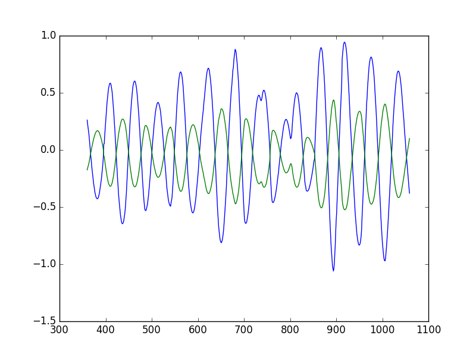
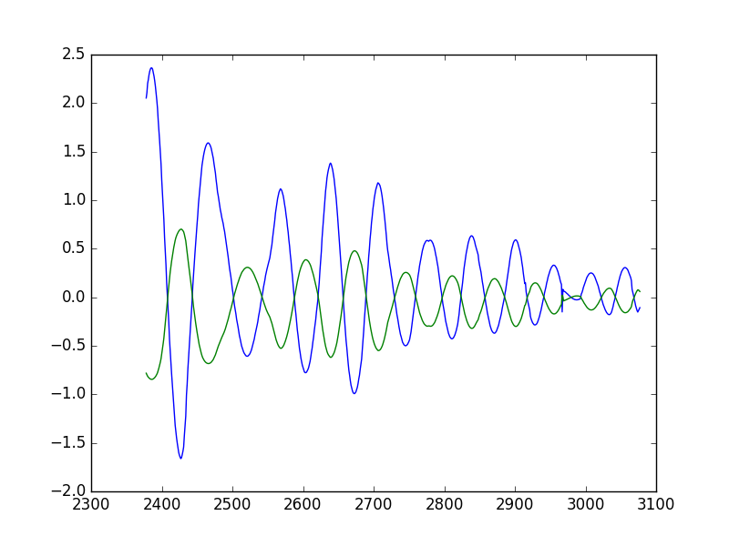

# CarND-Controls-PID
Self-Driving Car Engineer Nanodegree Program

---

## Dependencies

* cmake >= 3.5
* make >= 4.1
* gcc/g++ >= 5.4
* [uWebSockets](https://github.com/uWebSockets/uWebSockets) == 0.13, but the master branch will probably work just fine
* Simulator. You can download these from the [project intro page](https://github.com/udacity/CarND-PID-Control-Project/releases) in the classroom.

## Basic Build Instructions

1. Clone this repo.
2. Make a build directory: `mkdir build && cd build`
3. Compile: `cmake .. && make`
4. Run it: `./pid`.

## Design choices made in the implemetation of the PID controller

In any real application the effect that the actuation will have in the system will be limited
by physical limits, for example in this case the steering wheel which is limited to `[-1,1]`
 this was the first design choice.
 > How to map the controller output to the range of [-1,1]?

This implementation is using an adapted sigmoid to map all the possible output to the desired
range. The equation plays a crucial role in the response as it also defines part of the controllers
gain.

Here is the equation used: 

 
 

As shown in the graph the equation maps the controller input to the actuator range.

The tunning of the PID parameters was made following the [Ziegler-Nichols method](https://en.wikipedia.org/wiki/Ziegler%E2%80%93Nichols_method), which is in short.
By trial and error.

Here are the general steps:
1. Set all the gains to `0`
2. Set `Kp` to the value where the system has an stable oscillation.
3. Set the `Kp` to 60% of the gain in oscillation value.
4. Set the `Kd` to 50% of the value of the oscillation period.
5. Set the `Ki` to 25% of `Kd`

Then after using this euristic method, the car's behavior was not acceptable, so
further tunning was needed.

As the car was oscillating and going out the the track, by intuition the gain was increased.
Now the car was not going out of the road but it was oscillating quite bad in the middle, the
differential gain was increased.
As the car does not have time to reach an steady state the integral part is almost ignored.

At the end the final coefficients for the gain were:

| `Kp` | `Kd`     | `Ki`     |
| :------------- | :------------- | :------------- |
|2.9       | 1.835       | (neglected)  0.012     |

This values were selected by using a modified twiddle algorithm, in this case
we cannot measure the goodness of a solution in a short period of time. The modified
twiddle incremented the gain every time that the CTE went beyond our specified limit of
2.0.
If the behavior improved the coefficient was saved and then the next one was tunned.
After spending some time using this approach it turned out to not converge as fast
as needed, then we use this euristic.

If the car is oscillating increase the differential gain.
If the car is not reacting fast increase the gain and/or increase the sigmoid sensitivity.
The integral term ended-up to be neglected as it was saturating the controller and
causing delays in the controllers response.

Here are two graphs showing the oscillating behavior of the vehicle:
The geen line is the actuator input and the blue one is the CTE.

#### Before

#### After

Even with all the tunnig the car's behavior can be vastly improved.
Here are some open points for further work:
* Add hysteresis to the actuator input, to reduce oscillations in curves.
* Cascade two PID controllers to increase the range.
* Improve the saturation method even use an adaptive one.
* Take into account the delay caused by transport and inertia.

Here are video of the car going in the track.

### Anti-windup method
[src](https://www.mathworks.com/help/simulink/slref/pidcontroller.html#br58hc1-1) 
When the output of the controller is saturated and the controller includes
an integral term the block output holds the specified limit but the integrator
output continues to grow increasing the difference between block output
and the sum of the block components. Whitout this mechanism two results are
possible.

* If the sign of the output never changes the integral part will continue to sum
 and it eventually overflow.
* If the sign changes  once the weight sum is beyond the limit of the saturation. it can
take a long time to discharge the integrator and return to the inbound limits.
